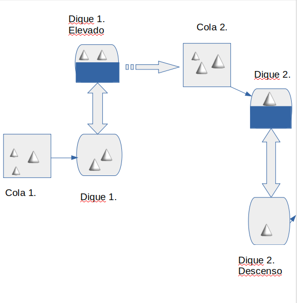

# Proyecto de Eventos Discretos.

*Autor: Adrian Gonzalez Sanchez*

*Grupo: C-412*

**Orden del Problema**:
Un canal marı́timo consiste en una o más exclusas colocadas en diques consecutivos de manera que la combinación de estas
permite el ascenso o descenso de los barcos, permitiendo el acceso del barco al dique siguiente. Estos canales son usados para la navegación a través de aguas turbulentas o para atravesar terrenos terrestres. Se desea conocer el tiempo de espera de los barcos para el uso de un canal con 5 diques para su funcionamiento. La operación de un canal puede ser dividido en dos ciclos muy similares que llamaremos ciclo de subida y ciclo de bajada. El ciclo de subida comienza con la compuerta del nivel superior cerrada y la compuerta del nivel inferior abierta. Los barcos esperando en el nivel inferior entran en el dique. Cuando los barcos se acomodan dentro del dique las puertas del nivel inferior se cierran y las puertas del nivel superior se abren y el agua del nivel superior inunda el dique, haciendo la función de un elevador marı́timo. Luego los barcos pasan al nivel superior, dejando el dique vacı́o. El ciclo de bajada consiste en el funcionamiento opuesto del ciclo descrito.

Ambos ciclos tienen las mismas 3 fases para su cumplimento, que se pueden llamar como fase de entrada, fase de transporte y fase de salida respectivamente. La fase de entrada consiste en abrir las puertas del nivel inferior y dejar entrar a
los barcos esperando hasta que estos se acomodan dentro del dique, la duración de este proceso depende del tiempo de apertura de las compuertas que distribuye de manera exponencial con λ = 4 minutos y el tiempo que se demora cada barco en entrar al dique, que distribuye de manera exponencial con λ = 2 minutos independientemente del tamaño de cada barco. Los barcos a entrar en el dique son tomados de manera secuencial de la cola de arribo de los barcos y en caso de que algún barco no quepa en el dique, el siguiente en la cola toma su lugar, en caso de que ningún barco quepa en el dique, la fase comienza sin llenar la capacidad del dique. 

La fase de transporte incluye cerrar la compuerta del nivel inferior, la apertura del nivel superior y el llenado del dique, esta fase tiene un tiempo de duración que distribuye de manera exponencial con λ = 7 minutos. La fase de salida se compone por la salida de los barcos del dique ası́ como el cerrar la puerta del nivel superior, esta fase tarda un tiempo que distribuye de manera exponencial con λ = 1,5 minutos por cada barco en el dique. El número total de barcos que pueden ser acomodados en un dique depende del tamaño fı́sico de los barcos. Estos tienen 3 tamaños distintos: pequeño, mediano y grande y el tamaño de cada uno de estos corresponde a la mitad del anterior. Cada dique puede albergar 2 filas con espacio para el equivalente a 3 barcos medianos (1 grande y dos pequeños). 

El tiempo de arribo de los barcos distribuye de acuerdo con la función Normal y dependen del tamaño del barco ası́ como de la hora del dı́a (el canal funciona de 8 am a 8 pm), los parámetros de la función se resumen en la tabla siguiente.

**Tamaño**  |  **8:00am - 11:00am**    | **11:00am - 5:00pm**    |  **5:00pm - 8:00pm**

Pequeño        |  | 

Mediano       |  | 

Grande         |  | 

## Ideas e interpretación

Para atacar este problema, primero hubo que llegar a un grupo de restricciones o reglas sobre el problema, que ayuden a modelar mejor la situación que se nos plantea. Se define entonces las siguientes invariantes:

***
* Un canal consiste en una combinación de diques.

* Cada dique tiene un modo (subida o bajada).

* Cada dique ejecuta una fase cuando tiene barcos disponibles y el dique no tiene ocupación, funcionando como un elevador (puede ser ascenso o descenso).

* Cada fase que ejecuta un dique hace que el dique ascienda o descienda (depende de su modo) y luego regresa a su posición.

* No necesariamente la fase de subida dura lo mismo que la de bajada (las distribuciones no necesariamente son iguales).

* En cada fase, se tiene en cuenta el tiempo que demora abrir o cerrar las compuertas.

* El canal funciona de 8:00 AM a 8:00 PM, o sea 12 horas o 720 minutos.

* Se asume que los barcos pueden llegar antes de la hora programada de funcionamiento del canal. Esta restricción permite acercarse un poco al funcionamiento real de los canales, ya que pueden existir eventos que hagan que un barco tenga que cambiar su ruta, o por calendario, la hora de llegada al canal no coincide con las 12 h de funcionamiento del mismo exactamente (ejemplo un crucero, que puede que llegue a las 7am al canal de Panamá y tenga que esperar 1h para poder cruzar). Generalmente estos casos son barcos grandes, por tanto se debe tener en cuenta a la hora de proveer de una función para calcular los arribos antes de tiempo. Estos eventos deben ser suficientes como para tenerlos en cuenta en el tiempo calculado, pero no tantos como para afectar sustancialmente este resultado.

* Los barcos entran y salen de los diques de manera secuencial.

Con estas reglas podemos definir un modelo de N-servidores en serie, donde cada dique es un servidor que atiende a los clientes que permanecen en su cola de epera (barcos) a medida que se desocupa (termina de procesar otros barcos o actualmente no procesa a nadie). Con esto en mente, nuestro objetivo es detectar el tiempo esperado de permanencia en cola de cada barco.

## Modelo

La figura representa una canal con dos diques, uno de subida y otro de bajada. Para subir, el dique 1 tiene que abrir sus compuertas superiores, cerrar las inferiores, cerrar las superiores, llenarse de agua, abrir las inferiores, trasladar los barcos a la cola del dique 2, cerrar las compuertas inferiores y vaciarse de agua para volver a su estado original. El dique 2 tiene que hacer el proceso inverso para mover los barcos fuera del canal.

Además, se puede notar que el dique 1 está procesando 2 barcos mientras que el dique 2 procesa 1; y ambos tienen barcos esperando en sus respectivas colas.

Entonces, se definen las siguientes variables para lograr este funcionamiento del canal:

* Variables de tiempo:

  1. : Tiempo total.
  
  2. : El tiempo en el cual se desocupa el dique i.
  
  3. : Tiempo que demora el dique i en procesar los barcos que toma de la cola.
